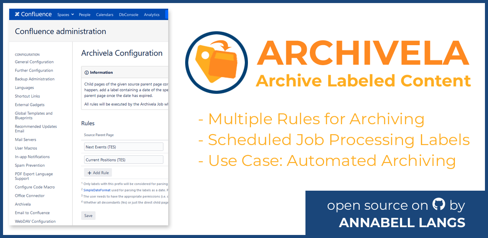
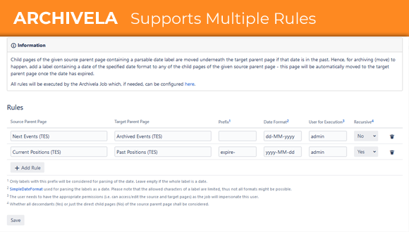
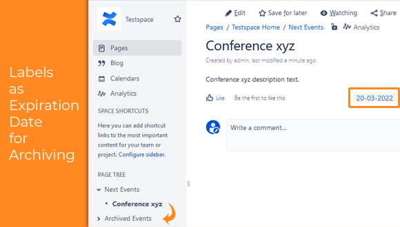
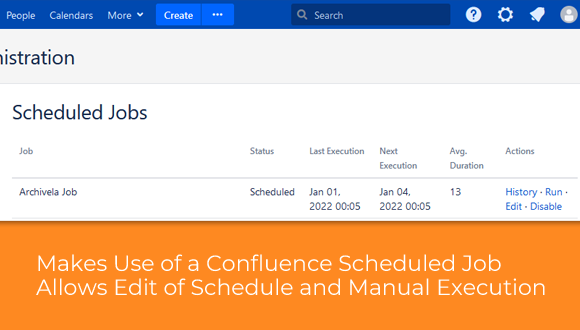

# Archivela Plugin for Confluence
> Archivela (**Archive** **La**beled Content) is a Confluence plugin which automatically archives pages with a label indicating expiration.

[![Confluence Version][conf-image]][conf-url] ![License][license-image]

This Confluence app can be used to achieve a basic page archiving process. Based on labels, it automatically archives (i.e. moves) pages to a new parent page. The labels need to be added by the users to pages under a configurable parent page and need to contain a date/time at which the page is deemed expired and shall be moved by the app.

The move operation is done through a standard Confluence scheduled job. The single job provided by this app reads the instance-wide rules that define which pages shall be processed for archiving. After the job has run (by default nightly), the identified pages have been moved by a configurable user to their new archive location.

Archivela takes the burden away from users that want to automatically move pages to a different location after a predefined date/time. Instead of remembering to move pages manually at a specific expiration time, the app will automatically move the pages when the time comes.









## Installation

Unfortunately it is no longer possible to publish Confluence Server apps on Atlassian's marketplace. Hence this app is not installable directly from the marketplace.

However you can install the jar file provided for each release on Github by uploading it as an app in Confluence's "Manage apps" administrative menu. For more details, see [Installing Marketplace apps - Installing by file upload][conf-install-app].

If you want to generate the jar file yourself, setup Atlassian's SDK developer environment as mentioned under [Development setup](#dev).

Then execute the following command:

```sh
atlas-package
```

This generates the jar file within Maven's target folder. 

## Usage

After installation, a new configuration page "Archivela" is available in Confluence's general administration (i.e. you need to have administration permissions).

Setup a rule that defines which pages shall be archived. The configuration page provides details on each of the options.

At 5 minutes past midnight a scheduled job will then archive the labeled pages as configured by the rules. The scheduled job can be changed to run at other intervals/times or can be triggered manually if needed.

## <a name="dev"></a>Development setup

Please see Atlassian's [Getting started][conf-dev] guidelines on SDK development for details on how to setup the environment. This provides the ```atlas-*``` commands.

Then execute the following command:

```sh
atlas-run
```

This launches a developer Confluence instance.

Though the macro was manually tested during development, there are currently no tests yet.

## Attribution and License

This plugin makes use of code (e.g. for storing the configuration of this plugin in Confluence) originating from [Email-to-Confluence][mail2blog]. Thank you for publishing this to the open source community making it possible to develop this plugin in a faster manner. Please see [its license][mail2blog-license] for details.

Hence this plugin is of course also distributed under the 3-Clause BSD [LICENSE][archivela-license].

## Contributing

This app is still under development, see also the [issues page][archivela-issues] for known problems.

I am happy to hear your feedback and getting a star :blush:. Please get in contact if you have found a bug or simply follow the general GitHub process by creating a pull request.


<!-- Markdown link & img dfn's -->
[conf-image]: https://img.shields.io/badge/Confluence-7.15.0-green.svg
[conf-dev]: https://developer.atlassian.com/server/framework/atlassian-sdk/
[conf-install-app]: https://confluence.atlassian.com/upm/installing-add-ons-273875715.html
[license-image]: https://img.shields.io/github/license/alangs/archivela.svg
[archivela-issues]: issues
[archivela-license]: LICENSE
[mail2blog]: https://github.com/dm-drogeriemarkt/Email-to-Confluence
[mail2blog-license]: src/main/resources/licenses/Email-to-Confluence/LICENSE